[Back to Main Page](README.md)

## Create WireGuard Server using Azure VM
Create a resource > Virtual machine > Create
<details>
  <summary>Example</summary>
  
  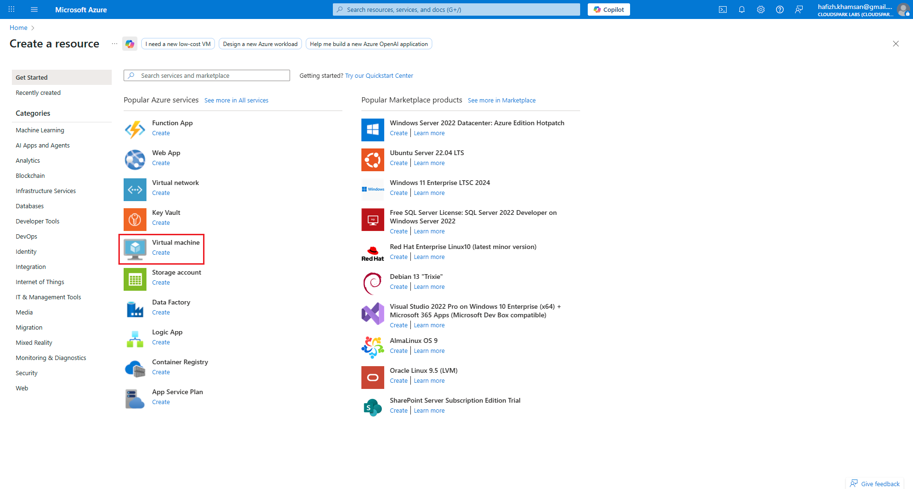
</details>

---

Configure Basics:
| Setting | Value |
| :--- | :--- |
| **Resource group** | WireGuard |
| **Virtual machine name** | wgserver |
| **Region** | Malaysia West |
| **Image** | Debian 12 |
| **Size** | B1s |
| **Authentication type** | SSH public key |
| **Username** | wgadmin |
| **SSH public key source** | Generate new key pair |
| **SSH Key Type** | Ed25519 SSH Format |
| **Key pair name** | wgserver_key |
| **Public inbound port** | Allow selected ports |
| **Select inbound ports** | SSH (22) |
<details>
  <summary>Example</summary>
  
  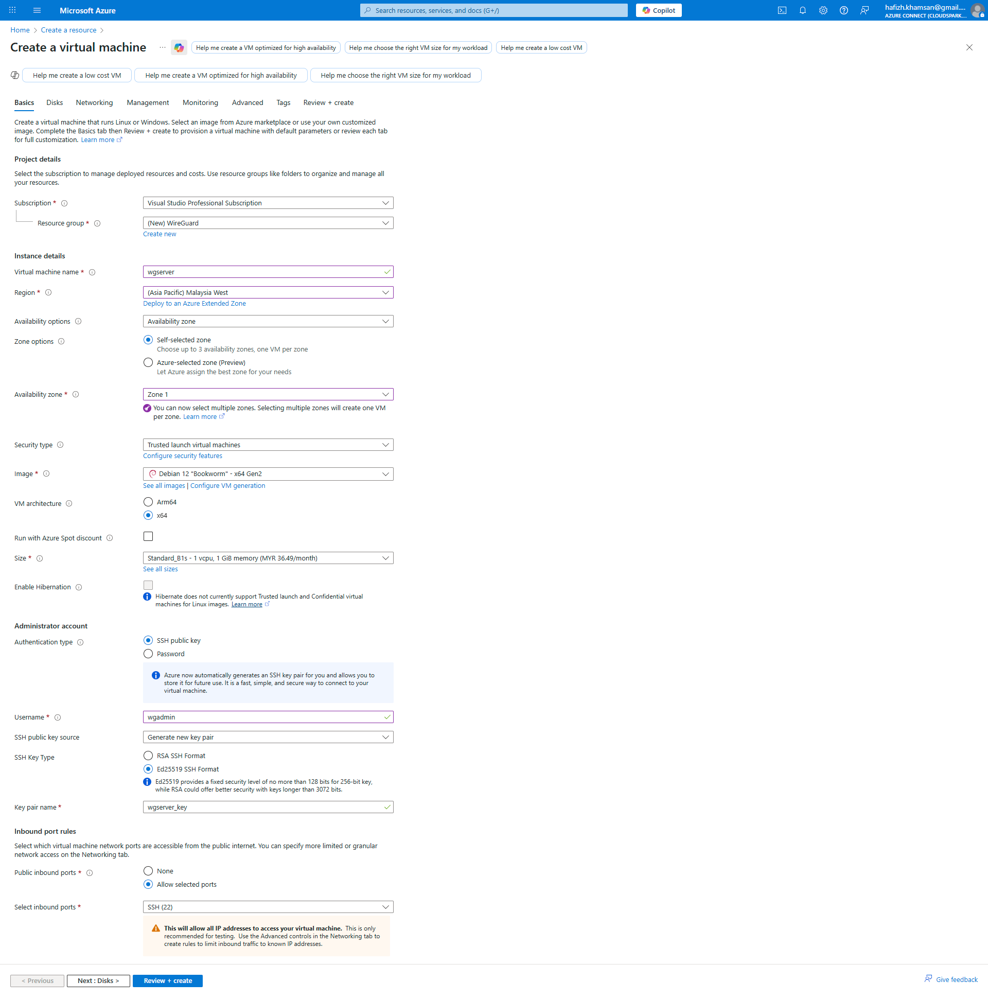
</details>

---

Configure Disks:
| Setting | Value |
| :--- | :--- |
| **OS disk size** | Image default (30 GiB) |
| **OS disk type** | Standard SSD (LRS) |
<details>
  <summary>Example</summary>
  
  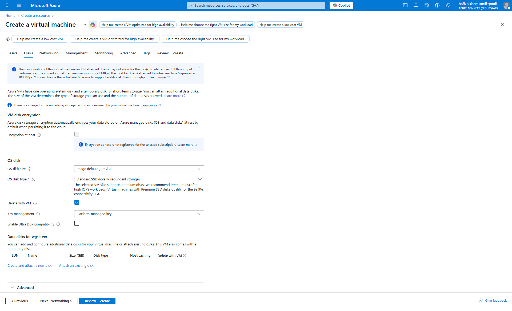
</details>

---

Configure Networking. Make sure to assign static public IP address.
<details>
  <summary>Example</summary>
  
  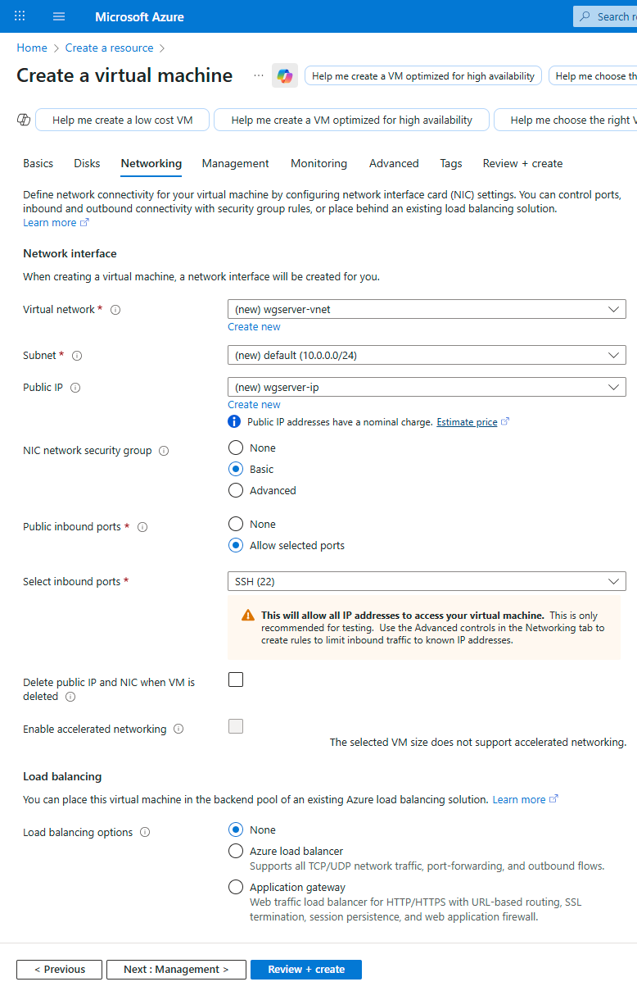
</details>

---

Review and create VM
<details>
  <summary>Example</summary>
  
  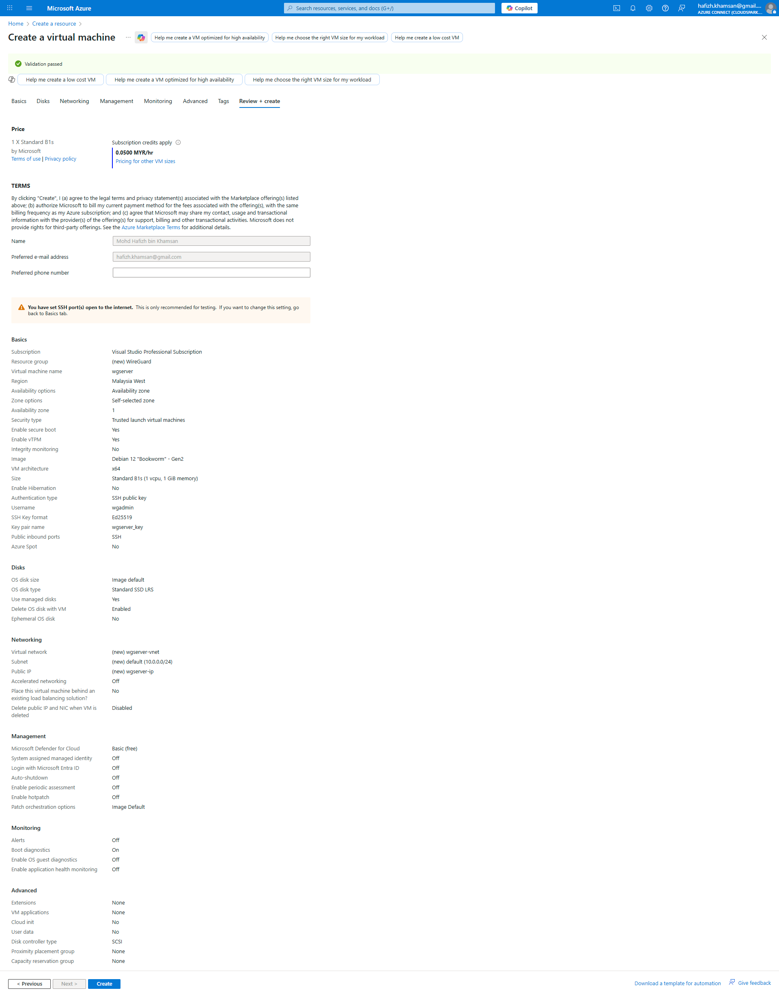
</details>

---

Download private key pair. Will use this to access SSH to Azure VM
<details>
  <summary>Example</summary>
  
  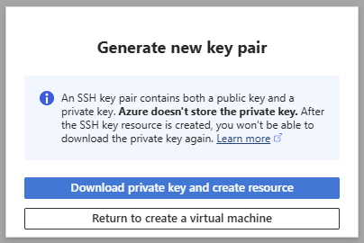
</details>

---

Deployment completed
<details>
  <summary>Example</summary>
  
  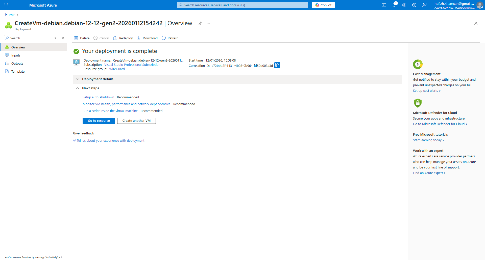
</details>

---

Open wgserver (Resource Manager > WireGuard > wgserver)
<details>
  <summary>Example</summary>
  
  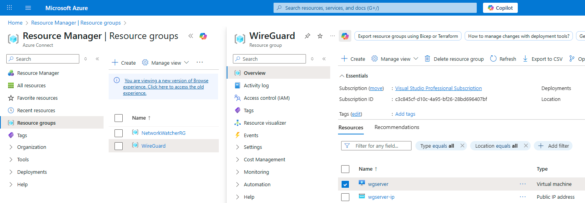
</details>

---

Check wgserver public IP address (wgserver > Essential > Primary NIC public IP)
<details>
  <summary>Example</summary>
  
  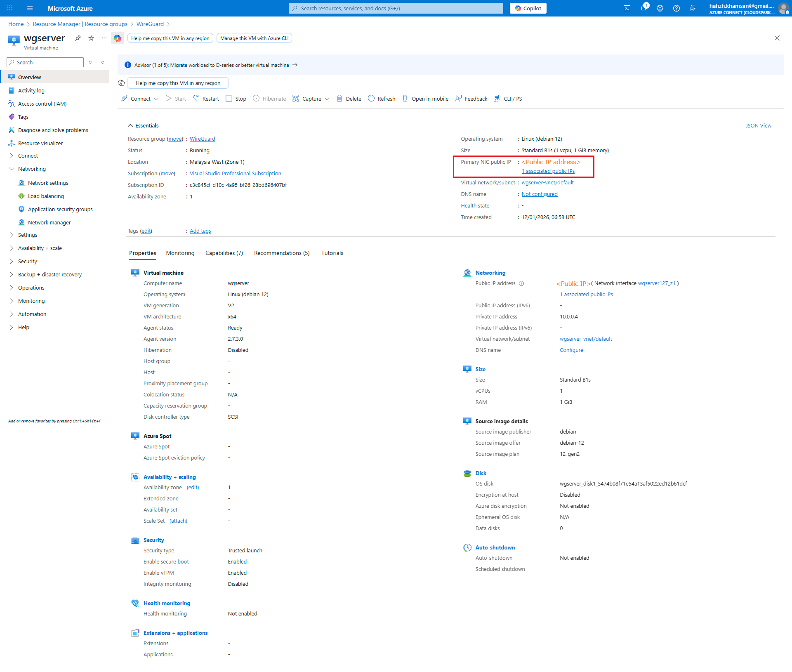
</details>

---

SSH to wgserver (using SecureCRT)
| Setting | Value |
| :--- | :--- |
| **Hostname** | (wgserver public IP) |
| **Username** | wgadmin |
| **Authentication** | PublicKey |

Configure Public Key (select PublicKey > click gear icon)
<details>
  <summary>Example</summary>
  
  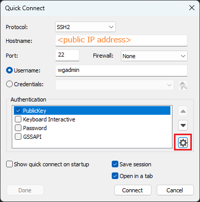
</details>

Select Use identity or certificate file > Select private key from Azure VM > click OK
<details>
  <summary>Example</summary>
  
  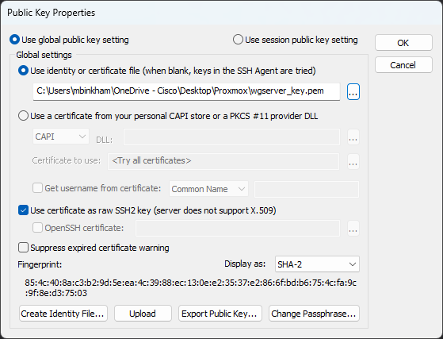
</details>

Connect

---

Update wgserver
```
wgadmin@wgserver:~$ sudo apt update
wgadmin@wgserver:~$ sudo apt upgrade
```
